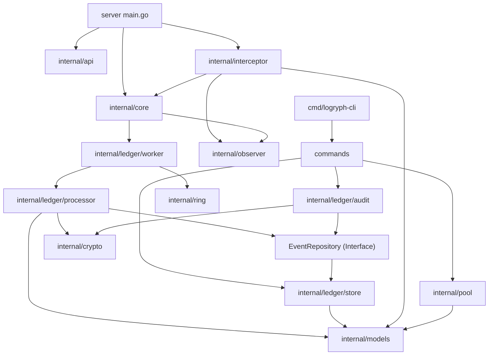

# Logryph Systems Architecture

This document is **optional**. Read it if you are reviewing design decisions, contributing to core modules, or doing a security/architecture review. If you just want to run Logryph, you can skip it.

Logryph (Associated Evidence Ledger) is a high-integrity forensic logger for AI agents, designed to meet NASA Power of Ten safety standards.

## Module Structure

## Core Components

### 1. Silent Observer (`internal/interceptor`, `internal/observer`)
*   **Role**: Passive interception of HTTP traffic between Agent and MCP Servers.
*   **Logic**: Uses `ObserverEngine` to match requests against `logryph-policy.yaml`.
*   **Dynamic Reloading**: Automatically polls the policy file for changes (5s interval) and updates rules without downtime.
*   **Safety**: Zero-blocking logic. All policy actions are observational (tagging, risk scoring, redaction).
*   **Models**: Converts HTTP requests into standardized `models.Event` structs.

### 2. Evidence Vault (`internal/ledger`, `internal/models`)
*   **Role**: Cryptographically secure append-only log of all agent actions.
*   **Persistence**: SQLite (`events` table) with strict strict sequence indexing.
*   **Integrity**:
    *   **SHA-256 Chaining**: Each event includes the hash of the previous event (Merkle chain).
    *   **Ed25519 Signing**: Every event is signed by the instance's private key.
    *   **Bitcoin Anchoring**: Automatically anchors chain state to Bitcoin blockchain every 10 minutes (via Blockstream API).

### 3. Async Ingestion (`internal/ring`, `internal/ledger/worker`)
*   **Role**: Decouples high-throughput interception from disk I/O.
*   **Mechanism**: Fixed-size Ring Buffer (`internal/ring`).
*   **Behavior**: Non-blocking submission. If buffer is full, events are dropped (fail-open) with metrics increment, preserving agent availability.

### 4. Forensic CLI (`cmd/logryph-cli`)
*   **Role**: Post-incident analysis and verification.
*   **Commands**:
    *   `verify`: Validates the cryptographic integrity of the entire chain.
    *   `trace`: Reconstructs causality trees for agent tasks (supports HTML export).
    *   `export`: Creates an Evidence Bag (ZIP) for legal handover.

### 5. Admin API (`internal/api`)
*   **Role**: Runtime observability and management.
*   **Endpoints**:
    *   `/metrics`: Prometheus-format metrics for production monitoring.
    *   `/api/metrics`: JSON metrics for internal dashboards.
    *   `/api/rekey`: Ed25519 key rotation endpoint.
*   **Metrics Exposed**: Pool performance, ledger throughput, backpressure, active tasks.

## Data Flow

1.  **Intercept**: Agent -> `interceptor` -> `models.Event`
2.  **Queue**: `models.Event` -> `ring.Buffer`
3.  **Process**: `worker` -> `processor` -> Sign & Hash
4.  **Persist**: `processor` -> `sqlite`
5.  **Anchor**: `sqlite` -> `Genesis/Anchor`

## Directory Layout

*   `cmd/logryph-cli`: CLI entry point and definitions.
*   `internal/core`: State management and orchestration.
*   `internal/models`: Shared data structures (`Event`).
*   `internal/observer`: Rule loading and evaluation.
*   `internal/ledger`: Core worker and orchestration.
*   `internal/ledger/store`: SQLite persistence layer and embedded schema.
*   `internal/ledger/audit`: Forensic verification and blockchain anchoring.
*   `internal/interceptor`: HTTP middleware.
*   `internal/crypto`: Key management and primitives.
*   `internal/assert`: NASA-compliant assertion safety.
