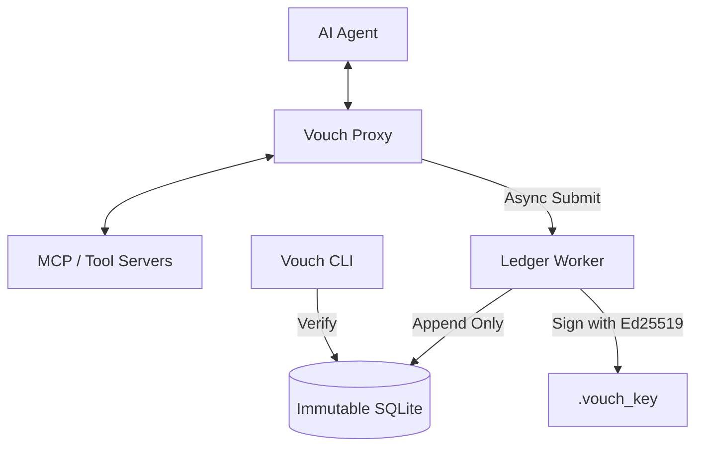

# Vouch Architecture Deep-Dive

This document outlines the technical architecture of Vouch: The Agent Black Box.

## System Overview

Vouch operates as a non-invasive transparent proxy between AI Agents and their Tool/MCP servers.

## Core Components

### 1. The Interception Layer (Proxy)
*   **Technology**: Go `httputil.ReverseProxy`.
*   **Responsibility**: Synchronously intercepts JSON-RPC traffic. It matches methods against the Policy Engine and enforces "Stalls" (Human-in-the-loop) for high-risk actions.
*   **Health Sentinel**: Monitors the Ledger Worker. If the ledger fails (e.g., disk full), the proxy "Fails Safe" and blocks further agent traffic.

### 2. The Immutable Ledger
*   **Data Model**: SHA-256 Hash Chain (Blockchain-style linkage).
*   **Serialization**: RFC 8785 (JSON Canonicalization Scheme) ensures deterministic hashing regardless of key order.
*   **Signing**: Ed25519 signatures generated for every block.
*   **Persistence**: SQLite with WAL (Write-Ahead Logging) for high concurrency.

### 3. The Governance Engine (Policy)
*   **Configuration**: YAML-based risk rules.
*   **Logic**: Wildcard method matching and parameter-level condition checks.
*   **Stall Intelligence**: Integrated with the Ledger to detect repeated failures or suspicious patterns.

## Data Flow (SEP-1686)

Vouch implements a specific state tracking protocol (SEP-1686) for long-running agent tasks.

1.  **Request `tool_call`**: Proxy intercepts, checks policy, redacts PII, and submits to Ledger.
2.  **Response `tool_response`**: Proxy intercepts results, updates the internal `task_id` state map, and submits to Ledger.
3.  **Terminal State**: Once a task hits `completed` or `failed`, the Ledger Worker triggers a `task_terminal` event and cleans up memory.

## Security Model

| Threat | Mitigation |
| :--- | :--- |
| **Log Tampering** | Hash chaining and Ed25519 signatures make retrospective edits detectable. |
| **Agent Escape** | Transparent proxying ensures the agent cannot "bypass" the logger. |
| **PII Leakage** | Synchronous redaction before data ever reaches the persistent ledger. |
| **Denial of Service** | Backpressure warnings and Fail-Closed health sentinel protect system integrity. |
